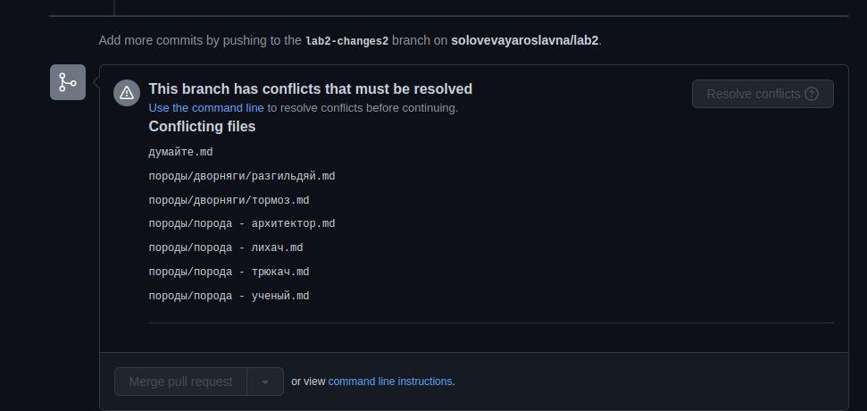
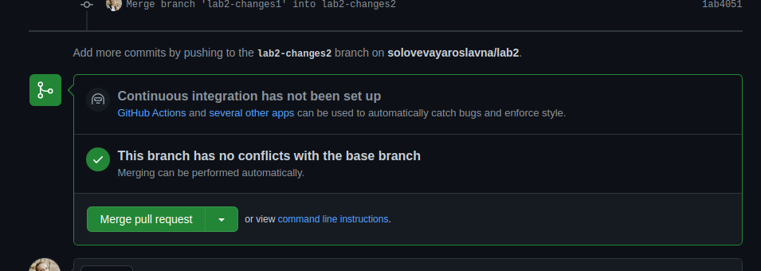

# Лабораторная работа №2

## шаг 1
- Скачайте данный репозиторий себе локально
- Переключитесь на ветку "start"
- Скопируйте себе все файлы репозитория на локальный компьютер (в том числе и readme)

## шаг2
- Зайдите в свой, ранее созданный репозиторий, либо создайте новый
- Переключитесь на самый первый initial коммит
- Создайте ветку lab2-main (если вы работаете в новом, чистом репозитории - то вы можете работать просто с веткой master или main). Ниже данная ветка будет упоминаться как lab2-main.
- Переключитесь на неё

## шаг3
- Ветка lab2-main это наша отправная точка (она не нужна в дальнейшей работе, но мы её создадим для красоты (если у вас новый чистый репозиторий то эта ветка у вас уже есть)
- Поместите скопированные ранее файлы из этого репозитория с ветки start себе на локальную машину
- Закомитьте данные файлы в ветку lab2-main
- Запушьте ветку lab2-main в удаленный репозиторий

## шаг3
- Создайте ветку lab2-changes1 от ветки lab2-main в своём репозитории (если вы создали новый репозиторий, вы можете называть ветки без приставки "lab2")
- Переключитесь на неё

## шаг4
- Вернитесь в репозиторий с материалами
- Переключитесь на ветку changes1 (не на lab2-changes1 а именно на changes1!!!)
- Скопируйте все файлы из ветки changes1
- Переместите файлы к себе в репозиторий (ваш репозиторий на ветке lab2-changes1 должен быть идентичен репозиторию задания на ветке changes1)
- Закомитьте данные изменения на ветку lab2-changes1 в своем репозитории
- Запушьте эту ветку в свой удаленный репозиторий

## шаг5
- В своем репозитории переключитесь на ветку lab2-main
- Создайте от ветки lab2-main ветку lab2-changes2
- Переключитесь на неё

## шаг6
- Вернитесь в репозиторий с материалами
- Переключитесь на ветку changes2 (не lab2-changes2 а именно changes2!!!)
- Скопируйте все файлы из ветки changes2
- Переместите файлы к себе в репозиторий (расположение файлов и папок (так называемый "слепок проекта") должен быть идентичен репозиторию задания. Т.е. вы можете удалить все файлы из своего репозитория (сделать его чистым и пустым) и полностью скопировать туда все папки и расположение файлов из репозитория задания)
- Закомитьте данные изменения на ветку lab2-changes2 в своем репозитории
- Запушьте эту ветку в свой удаленный репозиторий

## шаг7
- Перейдите в удаленный репозиторий и создайте PR как будто вы хотите вмержить ветку lab2-changes2 в lab2-changes1 (в конце PR вы увидите, что у вас конфликты и вы не можете сделать этого автоматически)

- Вернитесь в свой локальный репозиторий

## шаг8
- Переключитесь на ветку lab2-changes2 в своем репозитории
- Выполните merge ветки lab2-changes1 в ветку lab2-changes2 локально (У вас возникнут конфликты)
- Решите конфликты локально, используя любую среду разработки (можно и через консоль). (Перед тем как решать конфликты, ознакомьтесь с остальными подпунктами этого шага).
- Чтобы понять как решить тот или иной конфликт откройте в веб версии этого репозитория ветку lab2-changes2
- Её последний коммит - это результат, который должен у вас получиться
- Вы можете посмотреть в данном репозитории как именно выглядят файлы, а, следственно, понять какой вариант строки при решении конфликта вы должны выбрать.
- Так же обратите внимание что часть файлов при решении конфликтов изменила свое место нахождение - чтобы понять как поступать с ними так же обратите внимание на расположение файлов в этом репозитории на ветке lab2-changes2.
- Удачи в этой нелегкой борьбе!

Вам может помочь:
- официальная документация - https://git-scm.com/book/ru/v2/%D0%98%D0%BD%D1%81%D1%82%D1%80%D1%83%D0%BC%D0%B5%D0%BD%D1%82%D1%8B-Git-%D0%9F%D1%80%D0%BE%D0%B4%D0%B2%D0%B8%D0%BD%D1%83%D1%82%D0%BE%D0%B5-%D1%81%D0%BB%D0%B8%D1%8F%D0%BD%D0%B8%D0%B5)
- любое из видео на ютуб, в котором рассказывается, как решать конфликты, например это - https://www.youtube.com/watch?v=RDFOIUGVZpw

## шаг9
- Когда конфликты будут решены, убедитесь, что результат решения конфликтов сохранен коммитом в ветке lab2-changes2
- Запушьте ветку lab2-changes2 в удаленный репозиторий

## шаг10
- Перейдите в удаленный репозиторий и посмотрите в свой PR от ветки lab2-changes2 к ветке lab2-changes1
- Репозиторий должен сказать что все конфликты решены
- 
- Оставьте PR как есть (наличие PR без конфликтов и есть ваша сданная лабораторная).
- Лабораторная засчитывается, только если на ветке lab2-changes2 присутствует только коммит решения конфликта. Ручные изменения в lab2-changes2 и его подгонка под результат руками засчитаны не будут.

## шаг11
- В файле сдача лабораторных пис (https://docs.google.com/spreadsheets/d/1xyZNXR4wPLCH7TvFpAFitcS1k3ZdgxFBfJwpauPOJpU/edit#gid=1687966567) отметьте свою фамилию голубым цветом и смените статус на "лабораторная 2 готова к проверке"
- Включите режим ждуна =)
